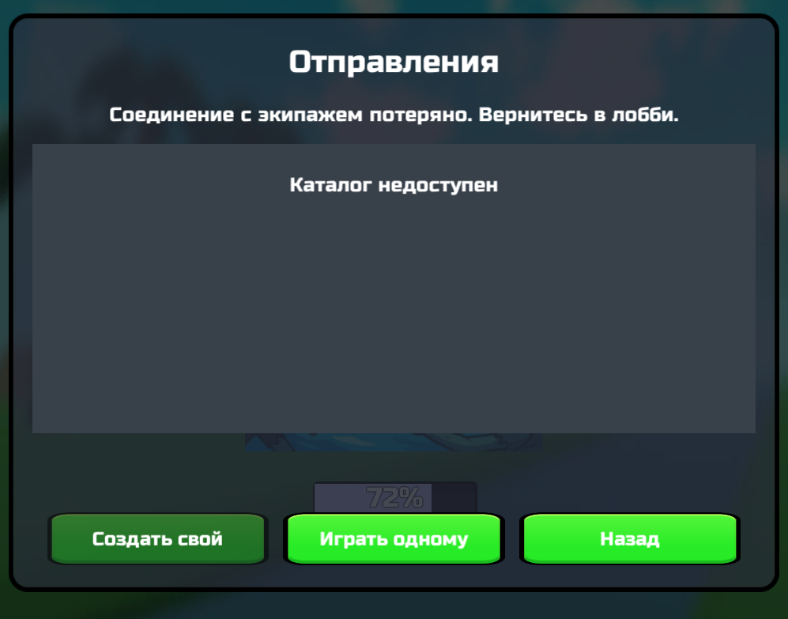

## Контекст

После отсчёта группа 1–4 загружает один уровень в одной Session; после завершения каждый может выйти отдельно.

## Готово, когда

- 1, 2, 3 и 4 клиента доходят до одного забега.
- Пятый не входит.
- Возврат не ломает лобби и solo-save.

## Подсказки ИИ

Нужен менеджер сетевых сцен вместо текущего `LobbySceneManager`, рассчитанного на готовую сцену лобби.

## Источники

- `Assets/Online/README.md`
- `Docs/WEB_MULTIPLAYER_IMPLEMENTATION_ROADMAP.md`

## Работа 2026-09-30

Реализован протокол Phase=2 → существующий GameLoader на каждом участнике; общий Runner/аватары сохраняются, один участник отключает Photon и идёт обычным solo-путём. Введён временный SharedRunPreviewSave для изоляции вызовов SaveManager. Это прототип совместной загрузки, физика и взаимодействия ещё локальны. Настоящая регистрация Fusion scene objects, ready-barrier и reconnect остаются. Следующий шаг — ИИ: проверить два клиента и добавить одну общую лодку/координаты; владелец: ручная приёмка загрузки/индивидуального выхода/solo-save.

Дизайн, ограничения и порядок: `Docs/SHARED_RUN_SEED_AND_PHYSICS.md`.

WebGL BuildPipeline завершился Success; архив `Builds/DeadBoatSharedSeedPreview-20260930.zip` (33 201 995 байт / 28 файлов) проверен ZIP CRC и загружен/сохранён в черновике 424778, file-id 13619742 (23:02:39). Совместная проверка двух клиентов ещё не выполнена.

Состояние площадки при завершении работы: распаковка прошла, активен этап «Проверка», «Готово» ещё недоступно. Открытие новой версии в браузере не подтверждено. Следующий шаг внешней площадки — закончить проверку; затем владелец проверяет два устройства, ИИ продолжает общую лодку.

Позднее 2026-09-30 владелец открыл новую сборку и сообщил о регрессии создания экипажа: «Лес», 2 места, «Не удалось создать экипаж. Попробуйте снова.». См. [DB-ON-051](DB-ON-051.md) со скриншотом. Совместный запуск пока не принят. Следующий шаг — ИИ: завтра сначала диагностировать и исправить создание экипажа; после этого вернуться к проверке двух клиентов и общей лодке.

## Переход в забег — 2026-10-02

В сборке `DeadBoatCrewCreationFix-20261002.zip` владелец подтвердил создание экипажа, присоединение и отсчёт 5 секунд. При загрузке появился экран «Соединение с экипажем потеряно», оба игрока выглядели как в отдельных одиночных забегах. Лог содержит `[Shared run] ... seed=-325669324; v=1; crew=2`, затем `Fusion Disconnect: DisconnectReason=ServerLogic, Message=ServerLogic`. Состав/сид перед загрузкой подтверждены для присланного клиента; причина отключения пока не доказана.

Найдены и исправлены два дефекта кода перехода: UI принимал передачу Runner менеджеру забега за потерю комнаты; удалённые аватары не получали DontDestroyOnLoad при Spawned (сохранялся только локально созданный экземпляр). Теперь UI закрывается перед загрузкой, все реплики аватаров сохраняются в Spawned. Это исправления доказанных дефектов, но нельзя считать их доказательством устранения ServerLogic Disconnect до повторного теста.

Добавлены безопасные логи причин Shutdown/Disconnect, признак sharedRun, лог connected/players/avatars/seed после загрузки. Панель прототипа показывает состояние подключения. Физика, лодка и игровые взаимодействия пока локальные, готовый кооператив не заявлен. Следующий шаг — ИИ: проверить переход сцены, собрать и загрузить новую версию; владелец: проверить двух клиентов после загрузки. При повторном отключении ИИ использует новую диагностику для установления причины.

Проверка Editor: один реальный клиент создал экипаж на 2 места; для отдельной проверки lifetime ветка совместного перехода была принудительно вызвана с CrewCount=2 (это не тест двух игроков и не приёмка roster). После загрузки `LevelForest` подтверждены `connected=True`, SharedRunContext.Active=True, один аватар и прежний сид. После фокуса Game View загрузка завершилась: Location=Game, Board.StartGame=True, Photon остался подключён. В фоне редактор был приостановлен с timeScale=0; исходники SDK не менялись. Двухклиентный WebGL и причина прежнего ServerLogic Disconnect остаются на проверке.

Для автоматизации сборки добавлена одноразовая очередь EditorApplication.update в игровом сборщике: длительный BuildPlayer больше не держит запрос MCP и не провоцирует повторные сборки из-за повторов инструмента.

Дополнительно менеджер забега и SharedRunPreviewSave перенесены на отдельный постоянный GameObject: уничтожение Runner больше не сбрасывает контекст во время загрузки. После фактического обрыва менеджер ждёт окончания загрузки и возвращает в лобби вместо продолжения одиночного забега. Проверка Editor с одним реальным подключением: переход сохранил connected=True, контекст, сид и отдельный lifetime. При принудительном уничтожении Runner сохранены context=True/save=True/lifetime=True. Отдельная проверка реальной загрузки с тестовым Runner и его уничтожением дошла до Scene=Lobby/Location=Lobby; потребовалось снять Editor pause, вызванный диагностическим Error. Сообщение об ожидаемом возврате заменено на Warning. Это тест жизненного цикла, не воспроизведение причины ServerLogic и не приёмка двух WebGL-клиентов.

Уточнение по диагностике: в Editor строка Fusion ServerLogic также наблюдалась после штатного Shutdown=Ok при выходе из визуального лобби в каталог. Поэтому сама такая строка в пользовательском логе не доказывает потерю именно Runner забега: это может быть поздний callback предыдущего соединения. Главный сигнал следующего теста — состояние Runner после загрузки, количество игроков/аватаров и наличие явного возврата в лобби.

Повторная приёмка владельцем после обновления черновика:

1. Полностью перезагрузить игру на двух клиентах; создать экипаж на 2 места и присоединиться вторым.
2. Дождаться отсчёта и загрузки: экран экипажей должен закрыться. На обеих панелях должны совпасть Seed/Generator/Level, состояние connected и players: 2.
3. Подойти друг к другу и проверить видимость аватаров/предметов в руках. Движение лодки и взаимодействия с предметами пока не являются сетевыми критериями этого прототипа.
4. Завершить/покинуть забег каждым клиентом отдельно; проверить возврат в лобби и одиночное сохранение.
5. Если произошёл обрыв — прислать лог с Shared run/Online transport и снимок панели. Продолжение как соло не должно происходить: ожидается возврат в лобби после завершения загрузки.

Следующий шаг — ИИ: завершить финальную сборку и загрузку; затем владелец: пункты выше. До ручной проверки задача остаётся in_progress.

Финальная сборка 2026-10-02 завершилась BuildPipeline Success. `Builds/DeadBoatSharedTravelFix-20261002.zip`: 33 276 040 байт, 28 файлов, ZIP CRC OK; загружена и сохранена в тестовом черновике 424778 (file-id 13671770), время консоли 19:18:25. При сохранении активна «Обработка»; запуск новой WebGL-версии и совместный переход владельцем ещё не подтверждены. Исходники исправлений запушены: e5c40172 и fc87c372. Следующий шаг внешней площадки — закончить обработку, затем владелец выполняет приёмку выше; ИИ разбирает новый лог, если проблема повторится.

## Timeout клиента и чёрный экран возврата — 2026-10-02

Владелец проверил новую сборку: лидер загрузил уровень, второй клиент получил чёрный экран с UI лобби; у лидера players: 1. Новый лог: crew=2/seed=787529786 → Disconnect=Timeout/sharedRun=True → Shutdown=DisconnectedByPluginLogic → Scene loaded connected=False → Returning to lobby → Bootstrap active/NullReferenceException. Обрыв Runner забега теперь доказан. Точную причину паузы (активация/генерация сцены, фон браузера или сеть) этот лог не содержит.

Чёрный экран воспроизведён в Editor: после автоматического возврата Scene=Lobby/Location=Lobby, PlayerManager отсутствовал и Camera.main=null. Возврат обходил штатный GameManager.EndGame, который сохраняет объект игрока перед выгрузкой сцены. Теперь используется штатный выход при доступном GameManager, запасной путь также сохраняет игрока. Ошибка Cannot set the parent of saber while it is being destroyed воспроизведена со стеком PickableItem.OnDestroy → Inventory.RemoveDestroyedItem → SwitchActiveItem; добавлено забывание уничтожаемого active item до выбора следующего.

Для комнат экипажа задан отдельный runtime Config с ConnectionTimeout=60s вместо 10s, глобальный asset/исходники SDK не менялись. Импортированная таблица PrefabTable сохраняется в копии (JSON не содержит runtime sources). Это запас на WebGL-загрузку, не доказательство устранения её задержек; обнаружение настоящего обрыва может стать дольше. Добавлены логи пауз кадров >5s/focus и наличие игрока/камеры после загрузки. Смысл ConnectionTimeout: https://doc-api.photonengine.com/en/fusion/current/class_fusion_1_1_network_configuration.html ; ограничения фона WebGL: https://doc.photonengine.com/fusion/v2/troubleshooting/known-issues .

Проверки Editor: создание экипажа прошло, SharedDepartureState существует, Runner.Config.Network.ConnectionTimeout=60. Один реальный peer, принудительная ветка crew=2 проверила lifetime: LevelForest/connected=True/camera=True. После уничтожения Runner: Scene=Lobby/Location=Lobby/player=True/camera=True/context=False; прежний чёрный экран и ошибки перепривязки в этом сценарии не повторились. Это не приёмка двух игроков и не проверка WebGL-таймаута. Следующий шаг — ИИ: собрать/загрузить; владелец: повторить тест двумя клиентами с обеими вкладками на виду (лучше отдельные устройства) и прислать лог при повторе.

BuildPipeline Success. Архив `Builds/DeadBoatClientTimeoutFix-20261002.zip`: 33 273 102 байт, 28 файлов, CRC OK. Загружен и сохранён в черновике 424778, file-id 13673558, время консоли 21:14:49 02/10/2026. После сохранения идёт «Обработка». Код запушен в 9cb9e99b. Следующий шаг — Яндекс: закончить обработку; владелец: повторить совместный запуск и возврат, подтвердить players: 2/одинаковый сид/видимость напарника. ИИ: при повторе Timeout анализировать новые frame-gap логи; пока успешный парный WebGL не подтверждён, к синхронизации лодки не переходить.
