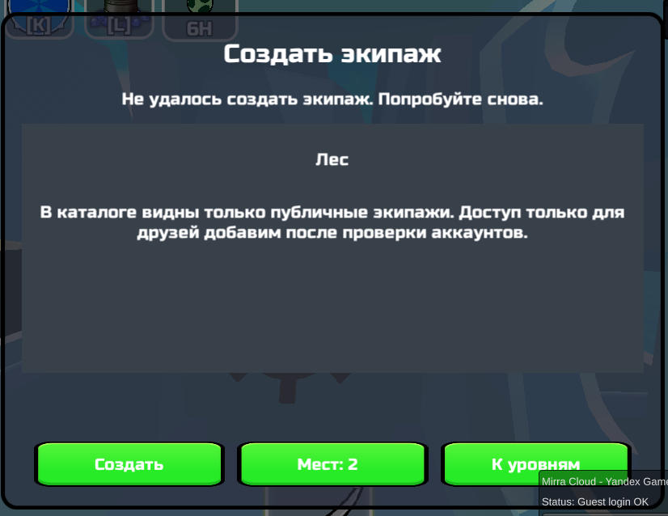
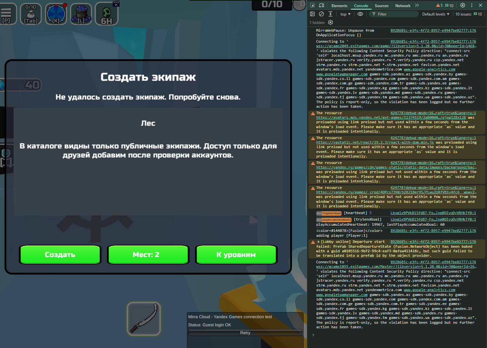

## Контекст

2026-09-30 владелец сообщил: экипаж перестал создаваться, хотя в предыдущей сборке создание работало. По просьбе владельца сегодня фиксируем ошибку; диагностика и исправление отложены до следующей рабочей сессии завтра.

Последняя загруженная сборка: `Builds/DeadBoatSharedSeedPreview-20260930.zip`, тестовый черновик Яндекс Игр `424778`, файл `13619742`. Предыдущая сборка: `Builds/DeadBoatOnlineUIFix-20260930.zip`, файл `13617427`. Сравнение поведения — сообщение владельца, независимое воспроизведение пока не выполнено.

На скриншоте окно «Создать экипаж», уровень «Лес», «Мест: 2» и ошибка «Не удалось создать экипаж. Попробуйте снова.». Панель Mirra показывает `Guest login OK`; это не подтверждает состояние подключения Photon и причину ошибки. Число попыток, состояние второго клиента и сетевые логи неизвестны.

Регрессия блокирует приёмку совместного запуска DB-ON-017. Причина не установлена; сегодня игровой код не исследуем и не меняем.

## Готово, когда

- Установлена и записана причина ошибки с безопасными диагностическими данными.
- В черновике создаётся публичный экипаж на 2–4 места; второй клиент может присоединиться.
- Одиночный запуск сохраняет работоспособность.
- Владелец подтвердил исправление в новой сборке; до приёмки использовать `in_review`.

## Подсказки ИИ

Следующий шаг — ИИ: завтра начать с воспроизведения и диагностики создания экипажа, затем исправить регрессию перед продолжением совместного запуска и синхронизации физики. Сейчас от владельца дополнительных действий не требуется. Не считать общий текст ошибки доказательством конкретной причины. Mirra SDK не изменять.

## Источники

- [Создание отправления — DB-ON-015](DB-ON-015.md)
- [Совместный запуск — DB-ON-017](DB-ON-017.md)
- `Assets/Online/LobbyOnlineBootstrap.cs`
- `Docs/SHARED_RUN_SEED_AND_PHYSICS.md`
- Сообщение и скриншот владельца от 2026-09-30.

## Диагностика и работа 2026-10-02

Владелец повторно воспроизвёл ошибку в прежнем WebGL-черновике и прислал консольный лог. Точный отказ: `Prefab SharedDepartureState (Fusion.NetworkObject) has been baked with a guid a0105516-9bf2-99c4-eaf3-0afaa411418c, but such guid failed to be translated into a prefab id by the object provider.` Комната Photon успевает подключиться; ошибка возникает при создании объекта состояния отправления. Это доказательство отсутствия нужного GUID в используемой таблице префабов сборки, а не отказа гостевого входа Mirra. Почему прежний импорт таблицы оказался устаревшим, отдельно не доказано.

В текущем редакторе таблица содержит этот GUID. Создание отдельной комнаты и вызов создания экипажа через LobbyOnlineBootstrap прошли успешно. Владелец видел тестовый экипаж редактора в каталоге WebGL. Это не является приёмкой создания из WebGL.

Добавлен `Assets/Online/Editor/OnlinePrefabBuildValidation.cs`: перед сборкой принудительно переимпортируется глобальный конфиг Fusion через Unity AssetDatabase; проверяются FusionPrefab-метки и присутствие GUID аватара и SharedDepartureState в таблице. При отсутствии сборка останавливается с явной ошибкой. Проверка действует также для обычной сборки из Unity; игровой сборщик дополнительно вызывает её перед BuildPipeline. Исходники SDK Photon/Mirra не изменены.

Дополнительно исправлен повторный клик «Создать» после отказа: прежний код закрывал Runner и сбрасывал browsingDepartures, но оставлял экран настройки, где все дальнейшие попытки отклонялись ранней проверкой. Теперь создание восстанавливает каталог. В редакторе после принудительного отключения Runner и сброса каталога повторное создание экипажа на 2 места прошло. Лог создания дополнен этапом и типом исключения; неуспешный StartGame пишет ShutdownReason.

Компиляция и проверка таблицы пройдены. Попытка дополнительного теста двух Runner в одном Editor не завершилась успешно (OperationTimeout; первая попытка также упёрлась в Addressables). Репликация сида и совместная загрузка этим тестом не подтверждены. Тестовые Runner закрыты выходом из Play Mode; сцену не сохраняли.

Запущена новая WebGL-сборка. Следующий шаг — ИИ: дождаться результата, проверить и загрузить архив в тестовый черновик; затем владелец: проверить создание/присоединение на двух клиентах и одиночный запуск. До ручной приёмки задача не закрыта.

WebGL BuildPipeline завершился `Success`. Архив `Builds/DeadBoatCrewCreationFix-20261002.zip`: 33 218 667 байт, 28 файлов, ZIP CRC OK; WebView-скрипты и глобальный Unity bridge проверены. Архив передан в форму загрузки тестового черновика 424778; сохранение и браузерная приёмка пока ожидаются.

Черновик сохранён 02.10.2026 в 16:58:52 (время консоли Яндекса), новый `file-id=13669400`. При фиксации результата активен этап «Обработка», «Проверка» и «Готово» ещё недоступны. Публикация и отправка на модерацию не выполнялись. Следующий шаг — площадка Яндекс: обработать архив; затем владелец: перезагрузить черновик, создать экипаж на 2 места, проверить присоединение второго клиента и одиночный запуск. ИИ после приёмки возвращается к DB-ON-017 (общий сид/совместная загрузка).
